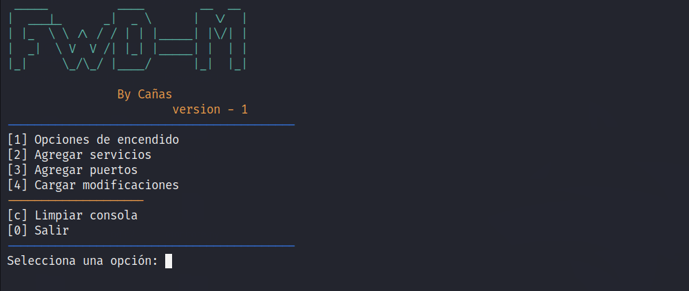
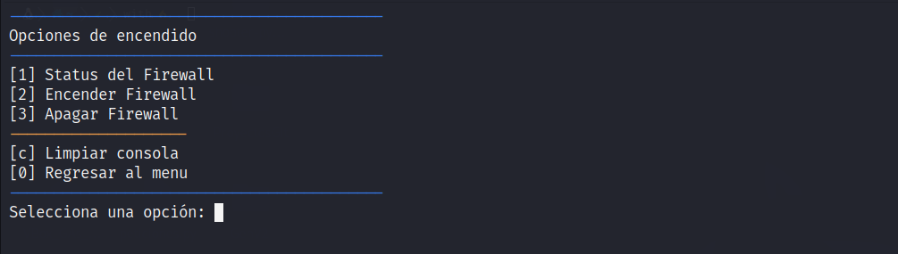
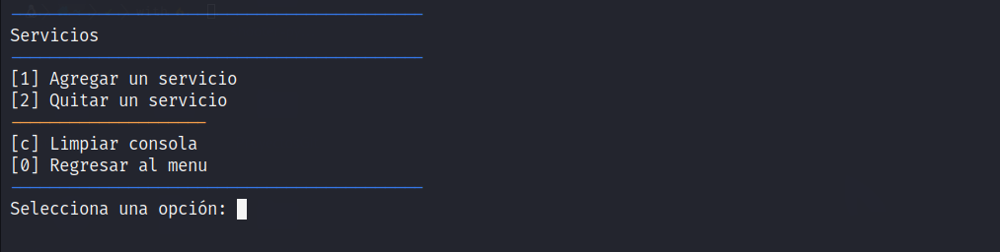
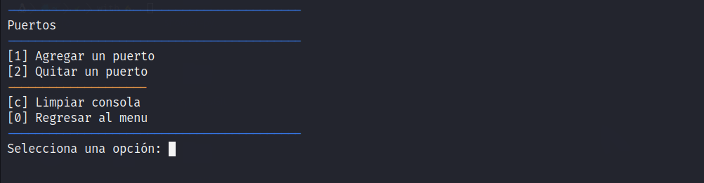

# FirewallDM
FirewallDM or FWD-M is a tool designed to simplify the use of another tool called "Firewalld" on Ubuntu servers. Firewalld is a dynamic firewall for Linux systems that provides a set of tools to manage network traffic.

FirewallDM is a console/terminal-based "graphical user interface" for Firewalld that allows inexperienced users to easily manage firewall configuration. The program can be installed on Ubuntu systems via the command line using the "apt-get" package manager.

It is important to note that to use FirewallDM, some prerequisites need to be installed on the server, such as Python3, Pip, Colorama, and others that may not be available by default on your system.

Once installed, FirewallDM provides several options for managing the Firewalld tool, such as the ability to add services and ports, as well as update and monitor firewall configuration. Additionally, the program also provides useful information on the current state of the firewall and applied rules on the system.

In summary, FirewallDM is a useful tool for those who want to manage Firewalld configuration on Ubuntu servers in an easy and efficient way. With its intuitive graphical user interface and multiple management options, this program is an excellent choice for users who have no experience in administering firewalls on Linux systems.







# Iinstallation Guide/Guia de instalación
Make sure you have an Ubuntu Server system without a graphical interface installed.
Open your system's terminal.

Clone the repository into your local directory using the following command:
```bash
git clone https://github.com/RodrigoDCP/FirewallDM.git
```

```bash
cd FirewallDM
```

```
./install.sh
```
This script will install all the necessary dependencies to run the Python code found in the repository.

Once the installation is complete, you can execute the code using the following command:
```bash
python3 fwd.py
```
That's it! You should now be able to run the code on your Ubuntu Server system without any issues.
